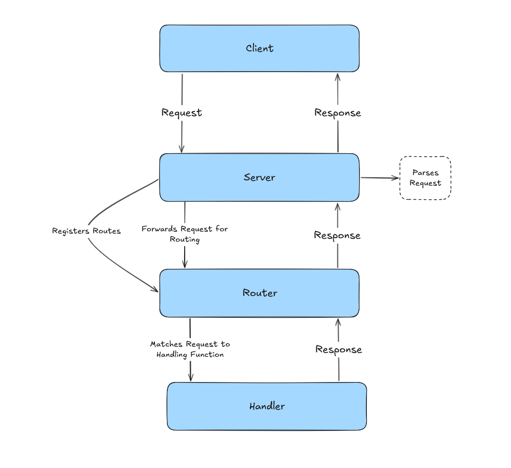

# rusty-http

A lightweight HTTP/1.1 server using only the Rust standard library. Allows for custom routes.

Built as a humble way to learn some Rust syntax, hopefully the first of many projects using this fun language. 

## Architecture



The server follows a layered architecture:

- **Server** - Listens for TCP connections, reads raw bytes, and delegates to the router
- **Router** - Matches incoming requests to registered handler functions by HTTP method and path
- **Handler** - Generates an `HttpResponse` for a matched route
- **Request Parser** - Parses raw bytes into a structured `HttpRequest` (method, path, headers, body)

## Getting Started

### Prerequisites

- Rust (edition 2024)

### Run the server

Define a desired port via the Makefile (default is 7878)

Example:

```sh
port ?= 7878
```
Then start the server

```sh
make run-server
```

### Test with curl

```sh

curl http://127.0.0.1:7878/
curl http://127.0.0.1:7878/about
curl -X POST -d "Hello, Rust!" http://127.0.0.1:7878/echo
```

## Project Structure

```
src/
  bin/
    server.rs        # TCP server entry point
    client.rs        # Client (stub)
  http/
    mod.rs           # Module exports
    request.rs       # HTTP request parsing
    response.rs      # HTTP response construction
    router.rs        # Route registration and matching
    handler.rs       # Built-in request handlers
  lib.rs             # Library root
```

## Usage

```rust
use rusty_http::http::{Router, Method, handler::*};

let mut router = Router::new();
router.add_route(Method::GET, String::from("/"), home_handler);
router.add_route(Method::GET, String::from("/about"), about_handler);
router.add_route(Method::POST, String::from("/echo"), echo_handler);
```

## Supported Methods

GET, POST, PUT, DELETE
